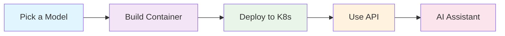

# <rh-icon name="rocket"></rh-icon> Ramalama Kubernetes - Easy LLM Deployment Made Simple

[](LICENSE)


> **Deploy powerful Language Models (LLMs) in Kubernetes with just a few commands!**

## <rh-icon name="target"></rh-icon> What is this?

Ramalama with Kubernetes makes it incredibly easy to run your own ChatGPT-like AI models in Kubernetes or OpenShift. Whether you're a developer, DevOps engineer, or AI enthusiast, this project helps you:

- <rh-icon name="running"></rh-icon> **Get started quickly** - Deploy AI models in minutes, not hours
- <rh-icon name="wrench"></rh-icon> **Use familiar tools** - Works with Docker, Kubernetes, and standard GitOps workflows  
- <rh-icon name="control-panel"></rh-icon> **Stay in control** - Run models on your own infrastructure, no external API calls needed
- <rh-icon name="package"></rh-icon> **Choose your model** - Easy support for popular models like Qwen, Llama, Mistral, and more
- <rh-icon name="arrows-sync"></rh-icon> **Scale effortlessly** - Built-in CI/CD, multi-environment support, and GitOps compatibility
- <rh-icon name="robot"></rh-icon> **AI-Powered Assistance** - Integrate with OpenShift Lightspeed for intelligent cluster management

## <rh-icon name="star"></rh-icon> Key Features

- **<rh-icon name="container"></rh-icon> Containerized Models**: Pre-built container images with popular LLMs
- **<rh-icon name="kubernetes"></rh-icon> Kubernetes Native**: Full Kubernetes and OpenShift support with GitOps
- **<rh-icon name="arrows-sync"></rh-icon> Automated CI/CD**: GitHub Actions pipeline for building and deploying models
- **<rh-icon name="color-palette"></rh-icon> Multiple Models**: Support for Qwen, Llama, Mistral, and custom models
- **<rh-icon name="chart-bar"></rh-icon> Production Ready**: Security contexts, resource management, and monitoring
- **<rh-icon name="tools"></rh-icon> Easy Management**: Simple scripts to add, remove, and manage models
- **<rh-icon name="robot"></rh-icon> OpenShift Lightspeed**: Built-in integration with Red Hat's AI assistant
- **<rh-icon name="building"></rh-icon> Simplified Architecture**: All models deploy to a single `ramalama` namespace

## <rh-icon name="building"></rh-icon> How It Works



1. **Choose your model** from our collection or add your own
2. **Build container images** with the model embedded
3. **Deploy to Kubernetes** using our GitOps-ready manifests
4. **Use the OpenAI-compatible API** to interact with your model
5. **Get AI assistance** for cluster management with OpenShift Lightspeed

That's it!

Really!

Seriously, not that complicated!

## <rh-icon name="clipboard-check"></rh-icon> Prerequisites

Before you begin, make sure you have:

- **<rh-icon name="container"></rh-icon> Container Runtime**: [Podman](https://podman.io/) 5+ (recommended) or Docker if you insist
- **<rh-icon name="kubernetes"></rh-icon> Kubernetes**: A running cluster (local or cloud)
- **<rh-icon name="wrench"></rh-icon> kubectl or oc**: [Kubernetes CLI](https://kubernetes.io/docs/tasks/tools/) or `oc` configured
- **<rh-icon name="git"></rh-icon> Git**: For cloning and managing the repository
- **<rh-icon name="storage"></rh-icon> Storage**: At least 4GB+ free space for model images

### <rh-icon name="desktop"></rh-icon> System Requirements

| Component | Minimum | Recommended |
|-----------|---------|-------------|
| **CPU** | 2 cores | 4+ cores |
| **RAM** | 4GB | 8GB+ |
| **Storage** | 10GB | 20GB+ |
| **Network** | Stable internet | High-speed connection |

## <rh-icon name="rocket"></rh-icon> Quick Start

### 1. Clone the Repository

```bash
git clone https://github.com/kush-gupt/ramalama-k8s.git
cd ramalama-k8s
```

### 2. Choose Your Adventure

**<rh-icon name="rocket"></rh-icon> Just Want to Try It?** → [Jump to Quick Deploy](#-quick-deploy)

**<rh-icon name="building"></rh-icon> Want to Build Your Own?** → [Continue to Build Guide](#%EF%B8%8F-building-your-own-images)

**<rh-icon name="kubernetes"></rh-icon> Ready for "Production"?** → [Check the Kubernetes Guide](#%EF%B8%8F-kubernetes-deployment)

## <rh-icon name="lightning"></rh-icon> Quick Deploy

Deploy a pre-built model in seconds:

```bash
# Create the ramalama namespace first
oc apply -f k8s/models/ramalama-namespace.yaml

# Deploy Qwen 4B model to your cluster
oc apply -k k8s/models/qwen3-4b

# Check if it's running
oc get pods -l model=qwen3-4b -n ramalama

# Access the API (when pod is ready)
oc port-forward -n ramalama svc/qwen3-4b-ramalama-service 8080:8080
```

<rh-icon name="celebration"></rh-icon> **That's it!** Your model is now running at `http://localhost:8080`

> [!NOTE]  
> **Simplified Namespace Structure**: All models deploy to the `ramalama` namespace for easier management and service discovery. This prevents namespace conflicts and just simplifies OpenShift Lightspeed integration.

### <rh-icon name="test-tube"></rh-icon> Test Your Model

```bash
# Test with a simple chat completion
curl -X POST http://localhost:8080/v1/chat/completions \
  -H "Content-Type: application/json" \
  -d '{
    "model": "default",
    "messages": [
      {"role": "user", "content": "Hello! How are you?"}
    ],
    "max_tokens": 100
  }'
```

## <rh-icon name="tools"></rh-icon> Building Your Own Images

Want to use a different model or customize the setup? Here's how:

### Step 1: Set Up Your Environment

```bash
# Set your container registry (change to your registry)
export IMAGE_OWNER="your-registry/username"  # e.g., "ghcr.io/myuser" or "quay.io/myorg"
export BASE_IMAGE_TAG="${IMAGE_OWNER}/centos-ramalama-min:latest"
```

### Step 2: Build the Base Image

This image contains all the dependencies and tools needed to run any model:

```bash
podman build \
  -f containerfiles/Containerfile-min \
  -t "${BASE_IMAGE_TAG}" \
  .
```

<rh-icon name="clock"></rh-icon> **This takes 10-15 minutes** - perfect time for a coffee break! <rh-icon name="coffee"></rh-icon>

### Step 3: Prepare Your Model

```bash
# Install Ramalama (if you haven't already)
curl -fsSL https://ramalama.ai/install.sh | bash

# Download and containerize your model
ramalama pull hf://unsloth/Qwen3-4B-GGUF/Qwen3-4B-Q4_K_M.gguf
ramalama convert hf://unsloth/Qwen3-4B-GGUF/Qwen3-4B-Q4_K_M.gguf oci://${IMAGE_OWNER}/qwen3-4b-source:latest

# Push to your registry
podman push ${IMAGE_OWNER}/qwen3-4b-source:latest
```

### Step 4: Build Your Model Image

```bash
export APP_IMAGE_TAG="${IMAGE_OWNER}/qwen3-4b-ramalama:latest"

podman build \
  -f containerfiles/Containerfile-qwen3-4b \
  --build-arg BASE_IMAGE_NAME="${BASE_IMAGE_TAG}" \
  --build-arg MODEL_SOURCE_NAME="${IMAGE_OWNER}/qwen3-4b-source:latest" \
  -t "${APP_IMAGE_TAG}" \
  .
```

### Step 5: Test Locally

```bash
podman run -it --rm -p 8080:8080 \
  ${APP_IMAGE_TAG} \
  llama-server \
  --port 8080 \
  --model /mnt/models/Qwen3-4B-Q4_K_M.gguf/Qwen3-4B-Q4_K_M.gguf \
  --host 0.0.0.0
```

<rh-icon name="celebration"></rh-icon> **Success!** Your model is now running at `http://localhost:8080`

## <rh-icon name="kubernetes"></rh-icon> Kubernetes Deployment

### <rh-icon name="target"></rh-icon> Model-Specific Deployment

Deploy individual models using their specific directories:

```bash
# Create the ramalama project first
oc apply -f k8s/models/ramalama-namespace.yaml

# Deploy specific models (all to the ramalama namespace)
kubectl apply -k k8s/models/qwen3-1b
kubectl apply -k k8s/models/qwen3-4b
kubectl apply -k k8s/models/qwen3-30b
kubectl apply -k k8s/models/deepseek-r1-qwen3-8b

# Check deployments in the ramalama namespace
kubectl get all -l app.kubernetes.io/name=ramalama -n ramalama
```

### <rh-icon name="globe"></rh-icon> Environment-Specific Deployment

For development and testing with environment-specific configurations:

```bash
# Development environment (includes namespace creation)
kubectl apply -k k8s/overlays/dev

# Production environment (includes namespace creation)
kubectl apply -k k8s/overlays/production

# Check deployments
kubectl get pods -n ramalama
```

> [!TIP]  
> **Environment overlays** include base model deployment configurations and are perfect for testing different resource allocations and settings.

### <rh-icon name="arrows-sync"></rh-icon> GitOps with OpenShift GitOps

For automated deployments with environment-specific configurations:

```bash
# Ensure OpenShift GitOps is installed
oc get csv -n openshift-gitops-operator | grep gitops

# Single model with environment overlay (Application)
oc apply -f k8s/argocd/application-example.yaml

# All models across environments (ApplicationSet)  
oc apply -f k8s/argocd/applicationset-example.yaml

# Monitor deployments
oc get applications -n openshift-gitops
```

> [!IMPORTANT]  
> **GitOps Deployment**: Environment overlays (`k8s/overlays/dev` and `k8s/overlays/production`) are designed for standalone testing and development. For anything close to production GitOps, use the model-specific deployments with ArgoCD Applications or ApplicationSets.

## <rh-icon name="robot"></rh-icon> OpenShift Lightspeed Integration

Get AI-powered assistance for your OpenShift cluster management! Deploy OpenShift Lightspeed with automatic integration to your ramalama models.

**All OpenShift Lightspeed resources deploy to the `openshift-lightspeed` namespace** for proper isolation and management.

### <rh-icon name="lightning"></rh-icon> Quick Deploy Lightspeed

```bash
# Ensure you have at least one model running in the ramalama namespace first, else create it!
oc get pods -n ramalama

# Option 1: Deploy with OpenShift GitOps
oc apply -f k8s/lightspeed/argocd/application-qwen3-4b.yaml

# Option 2: Deploy directly with Kustomize (two-step process)
# Step 1: Install operator and create CRDs
oc apply -k k8s/lightspeed/base/operator-only
oc wait --for=condition=Ready pod -l app.kubernetes.io/name=lightspeed-operator -n openshift-lightspeed --timeout=100s

# Step 2: Apply complete configuration
oc apply -k k8s/lightspeed/overlays/qwen3-4b

# Verify deployment in the openshift-lightspeed namespace
oc get all -n openshift-lightspeed
```

### <rh-icon name="star"></rh-icon> Features

- **<rh-icon name="brain"></rh-icon> Natural Language Queries**: Ask questions about your cluster in plain English
- **<rh-icon name="document"></rh-icon> YAML Generation**: Get help creating Kubernetes manifests
- **<rh-icon name="wrench"></rh-icon> Troubleshooting**: AI-powered assistance for debugging cluster issues
- **<rh-icon name="search"></rh-icon> Resource Investigation**: Understand what's happening in your cluster
- **<rh-icon name="arrows-sync"></rh-icon> GitOps Ready**: Fully automated deployment with ArgoCD
- **<rh-icon name="network"></rh-icon> Automatic Service Discovery**: Should Seamlessly connect to models in the `ramalama` namespace

### <rh-icon name="chat"></rh-icon> Example Usage

After deployment, you can ask OpenShift Lightspeed questions like:
- *"How do I troubleshoot a pod that won't start?"*
- *"Generate a deployment YAML for my application"*
- *"Why is my service not accessible?"*
- *"Show me how to configure resource limits"*

### <rh-icon name="wrench"></rh-icon> Enhanced Model Management with Lightspeed

Add new models with automatic Lightspeed integration:

```bash
# Add a model with Lightspeed overlay
./scripts/add-model.sh \
  --name "llama-7b" \
  --description "Llama 7B Chat model" \
  --model-gguf-url "hf://ggml-org/llama-7b/llama-7b.gguf" \
  --model-file "/mnt/models/llama-7b.gguf/llama-7b.gguf" \
  --create-lightspeed-overlay

# Deploy the model first
oc apply -k k8s/models/llama-7b

# Deploy Lightspeed integration (two-step process)
oc apply -k k8s/lightspeed/base/operator-only
oc wait --for=condition=Ready pod -l app.kubernetes.io/name=lightspeed-operator -n openshift-lightspeed --timeout=300s
oc apply -k k8s/lightspeed/overlays/llama-7b
```

This automatically creates:
- Model deployment configuration in the `ramalama` namespace
- OpenShift Lightspeed overlay with automatic service discovery
- Complete `olsconfig.yaml` for the model
- README with deployment instructions
- Proper service integration across the simplified namespace structure

<rh-icon name="book"></rh-icon> **For detailed Lightspeed setup**, see [k8s/lightspeed/README.md](k8s/lightspeed/README.md)

## <rh-icon name="control-panel"></rh-icon> Model Management

### Adding New Models

Our model management system makes it super easy to add new models:

```bash
# Interactive mode (recommended for beginners)
./scripts/add-model.sh --interactive

# Command line mode with Lightspeed
./scripts/add-model.sh \
  --name "llama-7b" \
  --description "Llama 7B Chat model" \
  --model-gguf-url "hf://ggml-org/llama-7b/llama-7b.gguf" \
  --model-file "/mnt/models/llama-7b.gguf/llama-7b.gguf" \
  --create-lightspeed-overlay
```

### Managing Models

```bash
# List all models
./scripts/list-models.sh

# Remove a model
./scripts/remove-model.sh llama-7b

# Generate from configuration
./scripts/generate-from-config.py
```

<rh-icon name="book"></rh-icon> **For detailed model management**, see [MODELS.md](MODELS.md)

## <rh-icon name="folder"></rh-icon> Repository Structure

```
ramalama-k8s/
├── <rh-icon name="folder"></rh-icon> containerfiles/          # Container build files
├── <rh-icon name="folder"></rh-icon> k8s/                     # Kubernetes manifests
│   ├── <rh-icon name="folder"></rh-icon> base/                # Base configurations  
│   ├── <rh-icon name="folder"></rh-icon> overlays/            # Environment-specific settings
│   ├── <rh-icon name="folder"></rh-icon> models/              # Model configurations
│   │   ├── <rh-icon name="document"></rh-icon> ramalama-namespace.yaml  # Shared namespace
│   │   └── <rh-icon name="folder"></rh-icon> */               # Individual model configs
│   ├── <rh-icon name="folder"></rh-icon> lightspeed/          # OpenShift Lightspeed integration
│   └── <rh-icon name="folder"></rh-icon> argocd/              # GitOps examples
├── <rh-icon name="folder"></rh-icon> scripts/                 # Management scripts
├── <rh-icon name="folder"></rh-icon> models/                  # Model configurations
├── <rh-icon name="document"></rh-icon> README.md                # This file
├── <rh-icon name="document"></rh-icon> MODELS.md                # Model management guide
└── <rh-icon name="document"></rh-icon> LICENSE                  # MIT license
```

## <rh-icon name="wrench"></rh-icon> Available Models

| Model | Size | Description | Status |
|-------|------|-------------|--------|
| **Qwen 1.7B** | ~1GB | Fast, lightweight model | <rh-icon name="check-circle"></rh-icon> Ready |
| **Qwen 4B** | ~2GB | Balanced performance | <rh-icon name="check-circle"></rh-icon> Ready |
| **Qwen 30B** | ~16GB | High-performance model | <rh-icon name="check-circle"></rh-icon> Ready |
| **DeepSeek R1** | ~4GB | Reasoning-focused model | <rh-icon name="check-circle"></rh-icon> Ready |
| **Custom** | Variable | Add your own! | <rh-icon name="wrench"></rh-icon> DIY |

## <rh-icon name="handshake"></rh-icon> Contributing

We would love contributions! Here's how you can help:

### <rh-icon name="rocket"></rh-icon> Quick Contributions

- **<rh-icon name="bug"></rh-icon> Report bugs** - Found something broken? Let me know!
- **<rh-icon name="lightbulb"></rh-icon> Suggest features** - Have ideas? Would love to hear them!
- **<rh-icon name="book"></rh-icon> Improve docs** - Help make things clearer for everyone
- **<rh-icon name="test-tube"></rh-icon> Test models** - Try new models and share your results

### <rh-icon name="building"></rh-icon> Development

```bash
# 1. Fork the repository
# 2. Clone your fork
git clone https://github.com/YOUR-USERNAME/ramalama-k8s.git

# 3. Create a feature branch
git checkout -b feature/amazing-feature

# 4. Make your changes
# 5. Test thoroughly
# 6. Submit a pull request
```

### <rh-icon name="clipboard-check"></rh-icon> Contribution Guidelines

- Follow existing code style
- Test your changes
- Update documentation
- Add examples for new features
- Be friendly and helpful! <rh-icon name="smile"></rh-icon>

### <rh-icon name="rocket"></rh-icon> Use Cases

- **<rh-icon name="building"></rh-icon> Enterprise**: Internal AI assistants and chatbots
- **<rh-icon name="graduation-cap"></rh-icon> Education**: Teaching AI and machine learning
- **<rh-icon name="microscope"></rh-icon> Research**: Experimenting with different models
- **<rh-icon name="home"></rh-icon> Personal**: Your own private AI assistant

## <rh-icon name="document"></rh-icon> License

This project is licensed under the MIT License - see the [LICENSE](LICENSE) file for details.

## <rh-icon name="heart"></rh-icon> Acknowledgments

- **[Ramalama](https://ramalama.ai)** - For making LLM deployment simple
- **[llama.cpp](https://github.com/ggerganov/llama.cpp)** - For efficient model inference
- **[Kubernetes](https://kubernetes.io)** - For container orchestration
- **[ArgoCD](https://argoproj.github.io/cd/)** - For GitOps workflows

---

## <rh-icon name="celebration"></rh-icon> Ready to Get Started?

1. **<rh-icon name="star"></rh-icon> Star this repository** if you find it useful
2. **<rh-icon name="fork"></rh-icon> Fork it** to make it your own
3. **<rh-icon name="download"></rh-icon> Clone it** and start deploying models
4. **<rh-icon name="rocket"></rh-icon> Deploy your first model** in minutes!

**Questions?** Don't hesitate to ask in our [GitHub Discussions](https://github.com/kush-gupt/ramalama-k8s/discussions)!

---

*Let Kush know if you'd like to see specific images or models in this repo!*

*Follow the original model licensing closely - I take no responsibility for any things you do with the content described here!*
