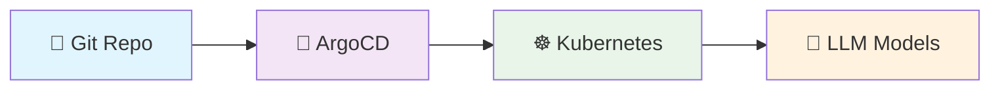
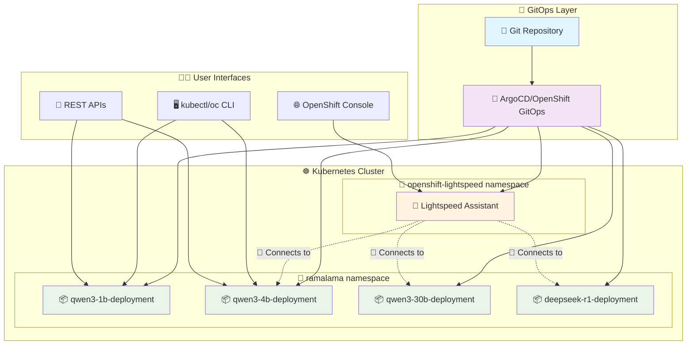

# 🚀 Ramalama Kubernetes - Easy LLM Deployment Made Simple

[](LICENSE)
[](https://redhat.com)
[](https://kubernetes.io)
[](https://openshift.com)

> **Deploy powerful Language Models (LLMs) in Kubernetes with just a few commands!**

## 🎯 What is this?

Ramalama with Kubernetes makes it incredibly easy to run your own ChatGPT-like AI models in Kubernetes or OpenShift. Whether you're a developer, DevOps engineer, or AI enthusiast, this project helps you:

- ⚡ **Get started quickly** - Deploy AI models in minutes, not hours
- 🔧 **Use familiar tools** - Works with Docker, Kubernetes, and standard GitOps workflows
- 🤖 **Production ready** - Includes monitoring, scaling, and security best practices
- 📦 **Model variety** - Support for multiple LLM models and sizes
- 🛡️ **Enterprise grade** - Built for OpenShift with proper RBAC and security policies

## ✨ Features

### 🏗️ **GitOps Architecture**


- **🔄 Declarative Deployments** - Everything as code with Kustomize
- **📈 Auto-scaling** - Horizontal pod autoscaling based on demand  
- **🔒 Security First** - Pod security standards and RBAC
- **📊 Monitoring Ready** - Prometheus metrics and health checks

### 🎭 **Multiple Model Support**

| Model | Size | Use Case | Status |
|-------|------|----------|---------|
| **Qwen 3 1.7B** | Small | 💬 Chat, Q&A | ✅ Ready |
| **Qwen 3 4B** | Medium | 💼 Business tasks | ✅ Ready |  
| **Qwen 3 30B** | Large | 🧠 Complex reasoning | ✅ Ready |
| **DeepSeek R1** | 8B | 🔬 Research tasks | ✅ Ready |

### 🛠️ **Developer Experience**

- **⚡ Quick Setup** - One command deployment
- **🔧 Easy Configuration** - YAML-based model definitions
- **📱 API Compatible** - OpenAI-compatible endpoints
- **🔍 Auto-discovery** - Automatic service discovery for OpenShift Lightspeed

## 🚀 Quick Start

### Prerequisites


- **☸️ Kubernetes/OpenShift cluster** with admin access
- **🐳 Container runtime** (Podman recommended, Docker works)
- **🔧 kubectl/oc CLI** configured

### 1️⃣ Clone and Explore

```bash
git clone https://github.com/kush-gupt/ramalama-k8s.git
cd ramalama-k8s

# 📋 List available models
./scripts/list-models.sh
```

### 2️⃣ Deploy Your First Model

#### 🎯 **Single Model (Recommended)**
```bash
# 🏗️ Create namespace
kubectl apply -f k8s/models/ramalama-namespace.yaml

# 🚀 Deploy Qwen 3 4B model  
kubectl apply -k k8s/models/qwen3-4b

# ✅ Verify deployment
kubectl get pods -l model=qwen3-4b -n ramalama
```

#### 🌍 **Environment-Based Deployment**
```bash
# 🧪 Development environment
kubectl apply -k k8s/overlays/dev

# 🏭 Production environment  
kubectl apply -k k8s/overlays/production
```

### 3️⃣ Test Your Model

```bash
# 🔗 Port forward to access the API
kubectl port-forward -n ramalama svc/qwen3-4b-ramalama-service 8080:8080

# 💬 Test the chat API
curl -X POST http://localhost:8080/v1/chat/completions \
  -H "Content-Type: application/json" \
  -d '{
    "model": "qwen3-4b-model",
    "messages": [{"role": "user", "content": "Hello! How are you?"}],
    "temperature": 0.7
  }'
```

## 🎛️ **OpenShift Lightspeed Integration**


Turn your deployed models into an AI-powered OpenShift assistant!

### 🎉 **One-Command Setup**
```bash
# 🔥 Deploy with GitOps
kubectl apply -f k8s/lightspeed/argocd/application-qwen3-4b.yaml

# 🔧 Or deploy directly
kubectl apply -k k8s/lightspeed/overlays/qwen3-4b
```

### 💡 **What You Get**
- **🤖 AI Assistant** integrated into OpenShift console
- **📝 YAML Generation** - "Create a deployment for nginx"  
- **🔍 Troubleshooting** - "Why is my pod failing?"
- **💡 Best Practices** - Expert OpenShift guidance

[📖 **Detailed Lightspeed Setup Guide**](k8s/lightspeed/README.md)

## 🏗️ **Architecture Overview**



## 🛠️ **Model Management**

### ➕ **Add New Models**


```bash
# 🎯 Interactive mode
./scripts/add-model.sh --interactive

# 🚀 Command line mode
./scripts/add-model.sh \
  --name "llama-7b" \
  --description "Llama 7B Chat model" \
  --model-gguf-url "hf://microsoft/Llama-7b-gguf" \
  --model-file "/mnt/models/llama-7b.gguf/llama-7b.gguf" \
  --create-lightspeed-overlay
```

### 📋 **List Models**
```bash
./scripts/list-models.sh
```

### 🗑️ **Remove Models**
```bash
./scripts/remove-model.sh llama-7b --force
```

## 🏭 **Production Deployment**

### 🎯 **With OpenShift GitOps**


```bash
# 🔄 Single model application
kubectl apply -f k8s/argocd/application-example.yaml

# 🌍 Multi-environment ApplicationSet
kubectl apply -f k8s/argocd/applicationset-example.yaml
```

### 📊 **Resource Requirements**

| Model Size | Memory | CPU | GPU | Storage |
|------------|--------|-----|-----|---------|
| **1.7B** | 4Gi | 2 cores | Optional | 10Gi |
| **4B** | 8Gi | 4 cores | Optional | 20Gi |
| **8B** | 16Gi | 8 cores | Recommended | 40Gi |
| **30B** | 32Gi | 16 cores | Required | 80Gi |

### 🔐 **Security Features**

- **🛡️ Pod Security Standards** - Restricted policies enforced
- **👤 Non-root execution** - All containers run as non-root user
- **🔒 RBAC** - Role-based access control
- **🔐 Network Policies** - Micro-segmentation ready
- **📋 Security Context** - Dropped capabilities and seccomp

## 📁 **Project Structure**

```
ramalama-k8s/
├── 📦 containerfiles/           # Container build definitions
├── ☸️ k8s/                      # Kubernetes manifests
│   ├── 🏗️ base/                 # Base Kustomize resources  
│   ├── 🎭 models/               # Model-specific configs
│   ├── 🌍 overlays/             # Environment overlays
│   ├── 🎯 lightspeed/           # OpenShift Lightspeed integration
│   └── 🔄 argocd/               # GitOps applications
├── 🤖 models/                   # Model configurations
├── 🛠️ scripts/                  # Management scripts
└── 📚 docs/                     # Documentation
```

## 🔧 **Configuration**

### 🎛️ **Model Parameters**
```yaml
# Example model configuration
configMapGenerator:
- name: ramalama-config
  literals:
  - CTX_SIZE=20048        # 🧠 Context window size
  - THREADS=14            # 🔄 CPU threads
  - TEMP=0.7              # 🌡️ Temperature (creativity)
  - TOP_K=40              # 🎯 Top-K sampling
  - TOP_P=0.9             # 📊 Top-P sampling
```

### 🌍 **Environment Variables**
```bash
# 🚪 API Configuration
PORT=8080
HOST=0.0.0.0

# 🧠 Model Settings  
MODEL_FILE=/mnt/models/model.gguf
CTX_SIZE=4096
THREADS=14

# �� Server Options
LOG_COLORS=true
NO_WARMUP=false
JINJA=true
```

## 🔍 **Monitoring & Troubleshooting**

### 📊 **Health Checks**
```bash
# ✅ Check model health
kubectl get pods -l app.kubernetes.io/name=ramalama -n ramalama

# 📝 View logs
kubectl logs -l model=qwen3-4b -n ramalama --tail=100

# 🔧 Debug service connectivity
kubectl port-forward -n ramalama svc/qwen3-4b-ramalama-service 8080:8080
curl http://localhost:8080/v1/models
```

### 🆘 **Common Issues**

| Issue | Solution |
|-------|----------|
| 🚫 Pod not starting | Check resource limits and node capacity |
| 🔌 API not responding | Verify port-forward and service endpoints |  
| 🐌 Slow responses | Increase CPU/memory or enable GPU |
| 📦 Image pull errors | Check registry credentials and image tags |

## 🤝 **Contributing**


1. **🍴 Fork** the repository
2. **🌿 Create** a feature branch (`git checkout -b feature/amazing-feature`)
3. **💾 Commit** your changes (`git commit -m 'Add amazing feature'`)
4. **📤 Push** to the branch (`git push origin feature/amazing-feature`)
5. **🔄 Open** a Pull Request

### 🎯 **Development Setup**
```bash
# 🏠 Local development
./scripts/build-script.sh
podman build -f containerfiles/Containerfile-min .

# 🧪 Test locally
./scripts/llama-server.sh
```

## 📚 **Documentation**

- **📖 [Kubernetes Deployment Guide](k8s/README.md)**
- **🎯 [OpenShift Lightspeed Integration](k8s/lightspeed/README.md)**  
- **🏗️ [Model Management](MODELS.md)**
- **🔄 [GitOps Setup](OPENSHIFT_GITOPS.md)**

## 📜 **License**

This project is licensed under the MIT License - see the [LICENSE](LICENSE) file for details.

## 🙋 **Support**

- **🐛 Issues**: [GitHub Issues](https://github.com/kush-gupt/ramalama-k8s/issues)
- **💬 Discussions**: [GitHub Discussions](https://github.com/kush-gupt/ramalama-k8s/discussions)
- **📧 Email**: [Support](mailto:support@example.com)

---

**🎉 Ready to deploy your own AI models?**

[](k8s/README.md)
[](k8s/lightspeed/README.md)

*Made with ❤️ for the open source community*
