# 🚀 Ramalama Kubernetes - Easy LLM Deployment Made Simple

[](LICENSE)


> **Deploy powerful Language Models (LLMs) in Kubernetes with just a few commands!**

## 🎯 What is this?

Ramalama with Kubernetes makes it incredibly easy to run your own ChatGPT-like AI models in Kubernetes or OpenShift. Whether you're a developer, DevOps engineer, or AI enthusiast, this project helps you:

- 🏃‍♂️ **Get started quickly** - Deploy AI models in minutes, not hours
- 🔧 **Use familiar tools** - Works with Docker, Kubernetes, and standard GitOps workflows  
- 🎛️ **Stay in control** - Run models on your own infrastructure, no external API calls needed
- 📦 **Choose your model** - Easy support for popular models like Qwen, Llama, Mistral, and more
- 🔄 **Scale effortlessly** - Built-in CI/CD, multi-environment support, and GitOps compatibility

## 🌟 Key Features

- **🐳 Containerized Models**: Pre-built container images with popular LLMs
- **☸️ Kubernetes Native**: Full Kubernetes and OpenShift support with GitOps
- **🔄 Automated CI/CD**: GitHub Actions pipeline for building and deploying models
- **🎨 Multiple Models**: Support for Qwen, Llama, Mistral, and custom models
- **📊 Production Ready**: Security contexts, resource management, and monitoring
- **🛠️ Easy Management**: Simple scripts to add, remove, and manage models

## 🏗️ How It Works

```mermaid
graph LR
    A[🔧 Pick a Model] --> B[🐳 Build Container]
    B --> C[☸️ Deploy to K8s]
    C --> D[🌐 Use API]
    
    style A fill:#e1f5fe
    style B fill:#f3e5f5
    style C fill:#e8f5e8
    style D fill:#fff3e0
```



1. **Choose your model** from our collection or add your own
2. **Build container images** with the model embedded
3. **Deploy to Kubernetes** using our GitOps-ready manifests
4. **Use the OpenAI-compatible API** to interact with your model

That's it!

Really!

Seriously, not that complicated!

## 📋 Prerequisites

Before you begin, make sure you have:

- **🐳 Container Runtime**: [Podman](https://podman.io/) 5+ (recommended) or Docker if you insist
- **☸️ Kubernetes**: A running cluster (local or cloud)
- **🔧 kubectl or oc**: [Kubernetes CLI](https://kubernetes.io/docs/tasks/tools/) or `oc` configured
- **🐙 Git**: For cloning and managing the repository
- **💾 Storage**: At least 4GB+ free space for model images

### 🖥️ System Requirements

| Component | Minimum | Recommended |
|-----------|---------|-------------|
| **CPU** | 2 cores | 4+ cores |
| **RAM** | 4GB | 8GB+ |
| **Storage** | 10GB | 20GB+ |
| **Network** | Stable internet | High-speed connection |

## 🚀 Quick Start

### 1. Clone the Repository

```bash
git clone https://github.com/kush-gupt/ramalama-k8s.git
cd ramalama-k8s
```

### 2. Choose Your Adventure

**🚀 Just Want to Try It?** → [Jump to Quick Deploy](#-quick-deploy)

**🏗️ Want to Build Your Own?** → [Continue to Build Guide](#%EF%B8%8F-building-your-own-images)

**☸️ Ready for "Production"?** → [Check the Kubernetes Guide](#%EF%B8%8F-kubernetes-deployment)

## ⚡ Quick Deploy

Deploy a pre-built model in seconds:

```bash
# Deploy Qwen 4B model to your cluster
kubectl apply -k k8s/overlays/dev

# Check if it's running
kubectl get pods -n ramalama-dev

# Access the API (when pod is ready)
kubectl port-forward -n ramalama-dev svc/qwen3-4b-ramalama-service 8080:8080
```

🎉 **That's it!** Your model is now running at `http://localhost:8080`

### 🧪 Test Your Model

```bash
# Test with a simple chat completion
curl -X POST http://localhost:8080/v1/chat/completions \
  -H "Content-Type: application/json" \
  -d '{
    "model": "qwen3-4b-model",
    "messages": [
      {"role": "user", "content": "Hello! How are you?"}
    ],
    "max_tokens": 100
  }'
```

## 🛠️ Building Your Own Images

Want to use a different model or customize the setup? Here's how:

### Step 1: Set Up Your Environment

```bash
# Set your container registry (change to your registry)
export IMAGE_OWNER="your-registry/username"  # e.g., "ghcr.io/myuser" or "quay.io/myorg"
export BASE_IMAGE_TAG="${IMAGE_OWNER}/centos-ramalama-min:latest"
```

### Step 2: Build the Base Image

This image contains all the dependencies and tools needed to run any model:

```bash
podman build \
  -f containerfiles/Containerfile-min \
  -t "${BASE_IMAGE_TAG}" \
  .
```

⏱️ **This takes 10-15 minutes** - perfect time for a coffee break! ☕

### Step 3: Prepare Your Model

```bash
# Install Ramalama (if you haven't already)
curl -fsSL https://ramalama.ai/install.sh | bash

# Download and containerize your model
ramalama pull hf://unsloth/Qwen3-4B-GGUF/Qwen3-4B-Q4_K_M.gguf
ramalama convert hf://unsloth/Qwen3-4B-GGUF/Qwen3-4B-Q4_K_M.gguf oci://${IMAGE_OWNER}/qwen3-4b-source:latest

# Push to your registry
podman push ${IMAGE_OWNER}/qwen3-4b-source:latest
```

### Step 4: Build Your Model Image

```bash
export APP_IMAGE_TAG="${IMAGE_OWNER}/qwen-4b-ramalama:latest"

podman build \
  -f containerfiles/Containerfile-qwen-4b \
  --build-arg BASE_IMAGE_NAME="${BASE_IMAGE_TAG}" \
  --build-arg MODEL_SOURCE_NAME="${IMAGE_OWNER}/qwen3-4b-source:latest" \
  -t "${APP_IMAGE_TAG}" \
  .
```

### Step 5: Test Locally

```bash
podman run -it --rm -p 8080:8080 \
  ${APP_IMAGE_TAG} \
  llama-server \
  --port 8080 \
  --model /mnt/models/Qwen3-4B-Q4_K_M.gguf/Qwen3-4B-Q4_K_M.gguf \
  --host 0.0.0.0
```

🎉 **Success!** Your model is now running at `http://localhost:8080`

## ☸️ Kubernetes Deployment

### 🎯 Simple Deployment

```bash
# Development environment
kubectl apply -k k8s/overlays/dev

# Production environment  
kubectl apply -k k8s/overlays/production
```

### 🔄 GitOps with ArgoCD

For automated deployments:

```bash
# Single model
kubectl apply -f k8s/argocd/application-example.yaml

# All models across environments
kubectl apply -f k8s/argocd/applicationset-example.yaml
```

## 🎛️ Model Management

### Adding New Models

Our model management system makes it super easy to add new models:

```bash
# Interactive mode (recommended for beginners)
./scripts/add-model.sh --interactive

# Command line mode
./scripts/add-model.sh \
  --name "llama-7b" \
  --description "Llama 7B Chat model" \
  --model-gguf-url "hf://ggml-org/llama-7b/llama-7b.gguf" \
  --model-file "/mnt/models/llama-7b.gguf/llama-7b.gguf"
```

### Managing Models

```bash
# List all models
./scripts/list-models.sh

# Remove a model
./scripts/remove-model.sh llama-7b

# Generate from configuration
./scripts/generate-from-config.py
```

📚 **For detailed model management**, see [MODELS.md](MODELS.md)

## 📁 Repository Structure

```
ramalama-k8s/
├── 📁 containerfiles/          # Container build files
├── 📁 k8s/                     # Kubernetes manifests
│   ├── 📁 base/                # Base configurations
│   ├── 📁 overlays/            # Environment-specific settings
│   ├── 📁 models/              # Model configurations
│   └── 📁 argocd/              # GitOps examples
├── 📁 scripts/                 # Management scripts
├── 📁 models/                  # Model configurations
├── 📄 README.md                # This file
├── 📄 MODELS.md                # Model management guide
└── 📄 LICENSE                  # MIT license
```

## 🔧 Available Models

| Model | Size | Description | Status |
|-------|------|-------------|--------|
| **Qwen 1.7B** | ~1GB | Fast, lightweight model | ✅ Ready |
| **Qwen 4B** | ~2GB | Balanced performance | ✅ Ready |
| **Qwen 30B** | ~16GB | High-performance model | ✅ Ready |
| **DeepSeek R1** | ~4GB | Reasoning-focused model | ✅ Ready |
| **Custom** | Variable | Add your own! | 🔧 DIY |

## 🤝 Contributing

We would love contributions! Here's how you can help:

### 🚀 Quick Contributions

- **🐛 Report bugs** - Found something broken? Let me know!
- **💡 Suggest features** - Have ideas? Would love to hear them!
- **📚 Improve docs** - Help make things clearer for everyone
- **🧪 Test models** - Try new models and share your results

### 🏗️ Development

```bash
# 1. Fork the repository
# 2. Clone your fork
git clone https://github.com/YOUR-USERNAME/ramalama-k8s.git

# 3. Create a feature branch
git checkout -b feature/amazing-feature

# 4. Make your changes
# 5. Test thoroughly
# 6. Submit a pull request
```

### 📋 Contribution Guidelines

- Follow existing code style
- Test your changes
- Update documentation
- Add examples for new features
- Be friendly and helpful! 😊


### 🚀 Use Cases

- **🏢 Enterprise**: Internal AI assistants and chatbots
- **🎓 Education**: Teaching AI and machine learning
- **🔬 Research**: Experimenting with different models
- **🏠 Personal**: Your own private AI assistant

## 📜 License

This project is licensed under the MIT License - see the [LICENSE](LICENSE) file for details.

## 🙏 Acknowledgments

- **[Ramalama](https://ramalama.ai)** - For making LLM deployment simple
- **[llama.cpp](https://github.com/ggerganov/llama.cpp)** - For efficient model inference
- **[Kubernetes](https://kubernetes.io)** - For container orchestration
- **[ArgoCD](https://argoproj.github.io/cd/)** - For GitOps workflows

---

## 🎉 Ready to Get Started?

1. **⭐ Star this repository** if you find it useful
2. **🍴 Fork it** to make it your own
3. **📥 Clone it** and start deploying models
4. **🚀 Deploy your first model** in minutes!

**Questions?** Don't hesitate to ask in our [GitHub Discussions](https://github.com/kush-gupt/ramalama-k8s/discussions)!

---

*Let Kush know if you'd like to see specific images or models in this repo!*

*Follow the original model licensing closely - I take no responsibility for any things you do with the content described here!*
