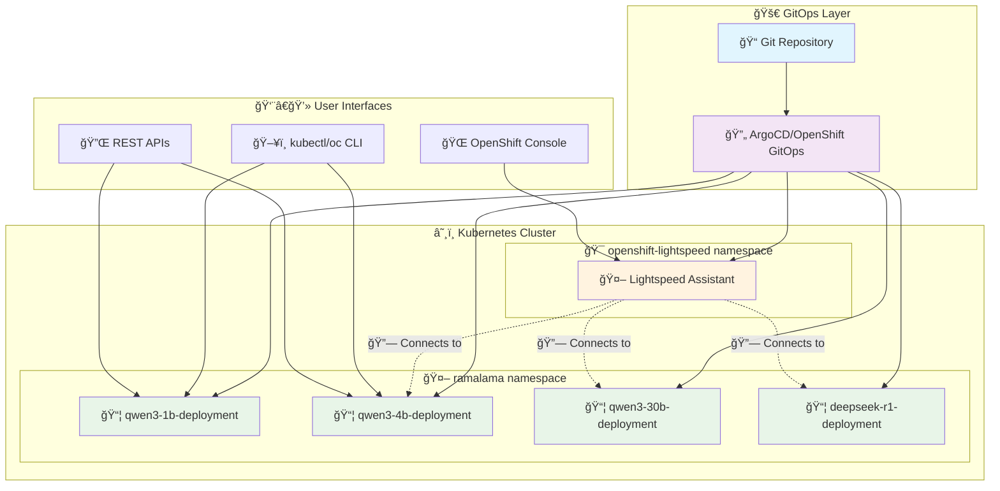

# 🚀 Ramalama Kubernetes - Easy LLM Deployment Made Simple

[](LICENSE)
[](https://kubernetes.io)
[](https://openshift.com)

> **Deploy powerful Language Models (LLMs) in Kubernetes with just a few commands!**

## What is this?

[Ramalama](https://github.com/containers/ramalama) with Kubernetes makes it incredibly easy to run your own ChatGPT-like AI models in Podman, Kubernetes or OpenShift. Whether you're a developer, DevOps engineer, or AI enthusiast, this project helps you:

- **Quick Setup** - One command deployment of AI Models
- **Use familiar tools** - Works with Podman, Kubernetes, and standard GitOps workflows
- **Kubernetes ready** - Includes monitoring, scaling, and security best practices
- **Model variety** - Support for multiple LLM models and sizes
- **Enterprise grade** - Built for OpenShift with proper RBAC and security policies

## Features

### **Architecture**

```mermaid
graph LR
    A[📝 Git Repo] --> B[🔄 Build Modelcars]
    B --> C[☸️ Podman or Kubernetes]
    C --> D[🤖 LLM Model serving OpenAI-like API]
    
    style A fill:#e1f5fe
    style B fill:#f3e5f5
    style C fill:#e8f5e8
    style D fill:#fff3e0
```


- **Declarative Deployments** - Everything as code with Kustomize and GitHub Actions for Modelcars
- **Security First** - SELinux, Kubernetes security standards and RBAC
- **Monitoring Ready** - Prometheus metrics and health checks

### 🎭 **Multiple Model Support**

| Model | Size | Status |
|-------|------|--------|
| **Qwen 3 1.7B**       | Small   | ✅ Ready |
| **Gemma 3n E4B**      | Small   | ✅ Ready |
| **Qwen 3 4B**         | Medium  | ✅ Ready |
| **Qwen 3 30B**        | Large   | ✅ Ready |
| **DeepSeek R1 Qwen3** | 8B      | ✅ Ready |
| **Custom**            | Any!    | ✅ Ready |

### 🔐 **Security Features**

- **Pod Security Standards** - Restricted policies enforced
- **Non-root execution** - All containers run as non-root user
- **RBAC** - Role-based access control
- **Network Policies** - Micro-segmentation ready
- **Security Context** - Dropped capabilities and seccomp

## 🚀 Quick Start

### Prerequisites


- **Kubernetes/OpenShift cluster** with admin access
- **Container runtime** (Podman recommended, Docker works if you insist)
- **kubectl or oc CLI** installed & configured

### 1️⃣ Clone and Explore

```bash
git clone https://github.com/kush-gupt/ramalama-k8s.git
cd ramalama-k8s
```

### 2️⃣ Deploy Your First Model

#### **Single Model with OpenShift (Recommended)**
```bash
# 🏗️ Create namespace with:
oc apply -f k8s/models/ramalama-namespace.yaml
# Or this:
oc create namespace ramalama

# 🚀 Deploy Qwen 3 1B model on CPU 
oc apply -k k8s/models/qwen3-1b

# ✅ Verify deployment
oc get pods -l model=qwen3-1b -n ramalama
```

#### **Or with Podman on Linux directly**
```bash
# At this point, you're better off using Ramalama directly if you just want inference on Linux:
ramalama serve hf://unsloth/Qwen3-1.7B-GGUF/Qwen3-1.7B-UD-Q4_K_XL.gguf

# But for directly testing the images built here:
podman run -p 8080:8080 ghcr.io/kush-gupt/qwen3-1b-ramalama /usr/bin/llama-server --port 8080 --model /mnt/models/Qwen3-1.7B-UD-Q4_K_XL.gguf/Qwen3-1.7B-UD-Q4_K_XL.gguf
```

### 3️⃣ Test Your Model

```bash
# 🧪 Deploy a test pod in the cluster to test service connectivity
oc run model-test --image=curlimages/curl:8.10.1 --rm -i --tty -n ramalama -- sh

# 💬 Inside the test pod, test the chat API (replace 'qwen3-1b' with your model name)
curl -X POST http://qwen3-1b-ramalama-service.ramalama.svc.cluster.local:8080/v1/chat/completions \
  -H "Content-Type: application/json" \
  -d '{
    "model": "default",
    "messages": [{"role": "user", "content": "Hello! How are you?"}],
    "temperature": 0.7
  }'

# 🔍 Test model availability
curl http://qwen3-1b-ramalama-service.ramalama.svc.cluster.local:8080/v1/models

# 📋 Exit the test pod (it will be automatically deleted due to --rm flag)
exit
```

## **OpenShift Lightspeed Integration**


Turn your deployed models into an AI-powered OpenShift assistant!

### 📋 **Prerequisites**
```bash
# ✅ Ensure you have at least one model running first
oc get pods -n ramalama

# 🚀 If no project or models are deployed, deploy them first:
oc apply -f k8s/models/ramalama-namespace.yaml
oc apply -k k8s/models/qwen3-4b
```

### 🎯 **Deployment Options**

#### **Option 1: Direct Kustomize (Two-Step Process, reliable and minimalist)**
Due to operator timing dependencies, direct deployment requires two steps:

```bash
# 🔧 Step 1: Install operator and create CRDs
oc apply -k k8s/lightspeed/base/operator-only

# ⏳ Step 2: Wait for operator to be ready (this creates the required CRDs)
oc wait --for=condition=Available deployment -l app.kubernetes.io/created-by=lightspeed-operator -n openshift-lightspeed --timeout=100s

# 🎯 Step 3: Link lightspeed to the ramalama service
oc apply -k k8s/lightspeed/overlays/qwen3-4b
```

#### **Option 2: GitOps Deployment (If you have it installed)**
```bash
# 🔥 Deploy with ArgoCD - single command that should handle timing automatically
oc apply -f k8s/lightspeed/argocd/application-qwen3-4b.yaml

# ✅ Monitor deployment
oc get applications -n openshift-gitops | grep lightspeed
```

### **What You Get**
- **AI Assistant** integrated into OpenShift console
- **YAML Generation** - "Create a deployment for nginx"  
- **Troubleshooting** - "Why is my pod failing?"
- **Best Practices** - Expert OpenShift guidance
- **Auto-discovery** - Automatically connects to your deployed models

### **Verification**
```bash
# ✅ Check all components are running
oc get pods -n openshift-lightspeed
oc get olsconfig cluster -n openshift-lightspeed
```

[📖 **Detailed Lightspeed Setup Guide**](k8s/lightspeed/README.md)

## 🏗️ **Architecture Overview**



## **Model Management**

### **Add New Models**


```bash
# 🎯 Interactive mode
./scripts/add-model.sh --interactive

# 🚀 Command line mode with Lightspeed generation w/llama-7b as an example
./scripts/add-model.sh \
  --name "llama-7b" \
  --description "Llama 7B Chat model" \
  --model-gguf-url "hf://microsoft/Llama-7b-gguf" \
  --model-file "/mnt/models/llama-7b.gguf/llama-7b.gguf" \
  --create-lightspeed-overlay
```

**Auto-Generated Files:**
- 📦 `containerfiles/Containerfile-llama-7b`
- ☸️ `k8s/models/llama-7b/kustomization.yaml`
- 🎯 `k8s/lightspeed/overlays/llama-7b/kustomization.yaml`
- 🤖 `k8s/lightspeed/overlays/llama-7b/olsconfig.yaml`
- 📖 `k8s/lightspeed/overlays/llama-7b/README.md`
- ⚙️ `models/llama-7b.conf`

### **List Models**
```bash
./scripts/list-models.sh
```

### **Remove Models**
```bash
./scripts/remove-model.sh llama-7b --force
```

## **Configuration**

### **Model Parameters**
```yaml
# Example model configuration
configMapGenerator:
- name: ramalama-config
  literals:
  - CTX_SIZE=20048        # 🧠 Context window size
  - THREADS=14            # 🔄 CPU threads
  - TEMP=0.7              # 🌡️ Temperature (creativity)
  - TOP_K=40              # 🎯 Top-K sampling
  - TOP_P=0.9             # 📊 Top-P sampling
```

### **Environment Variables**
```bash
# 🚪 API Configuration
PORT=8080
HOST=0.0.0.0

# 🧠 Model Settings  
MODEL_FILE=/mnt/models/model.gguf
CTX_SIZE=4096
THREADS=14

# �� Server Options
LOG_COLORS=true
NO_WARMUP=false
JINJA=true
```

## 🤝 **Contributing**


1. **🍴 Fork** the repository
2. **🌿 Create** a feature branch (`git checkout -b feature/amazing-feature`)
3. **💾 Commit** your changes (`git commit -m 'Add amazing feature'`)
4. **📤 Push** to the branch (`git push origin feature/amazing-feature`)
5. **🔄 Open** a Pull Request

### **Development Setup**
```bash
# 🏠 Local development
./scripts/build-script.sh
podman build -f containerfiles/Containerfile-min .

# 🧪 Test locally
./scripts/llama-server.sh
```

## 📚 **Documentation**

- **[Kubernetes Deployment Guide](k8s/README.md)**
- **[OpenShift Lightspeed Integration](k8s/lightspeed/README.md)**  
- **[Model Management](MODELS.md)**
- **[GitOps Setup](OPENSHIFT_GITOPS.md)**

## 📜 **License**

This project is licensed under the MIT License - see the [LICENSE](LICENSE) file for details.

## 🙋 **Support**

- **🐛 Issues**: [GitHub Issues](https://github.com/kush-gupt/ramalama-k8s/issues)
- **💬 Discussions**: [GitHub Discussions](https://github.com/kush-gupt/ramalama-k8s/discussions)
---

**🎉 Ready to deploy your own AI models?**

[](k8s/README.md)
[](k8s/lightspeed/README.md)

*Made for the open source community*
