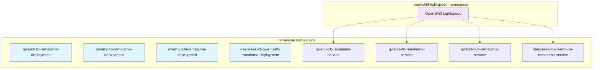

# Ramalama Kubernetes GitOps Deployment

This directory contains GitOps-compatible Kubernetes manifests for deploying Ramalama LLM models using Kustomize and ArgoCD.

## Important Changes

### Simplified Namespace Structure
**All models deploy to the `ramalama` namespace** for simplified management and better auto-detection with OpenShift Lightspeed. This consolidates all model services into a single namespace, making service discovery and integration more straightforward.

**Why a Single Namespace?**
- **🔗 Service Discovery**: Simplified networking between models and Lightspeed
- **🛡️ Security**: Easier RBAC and network policy management
- **🔧 Management**: Single point of configuration and monitoring
- **🚫 Conflict Prevention**: Avoids namespace prefix conflicts from Kustomize

### Model Path Changes
**Note**: All configurations in this directory now use `/mnt/models/` paths instead of `/models/` for model files. This change provides better alignment with container runtime expectations and default execution behavior. If you have existing deployments, you may need to update your configurations and rebuild your container images.

**Standard Model Path Format**: All model files must be referenced using the format:
```
/mnt/models/Model-Name.gguf/Model-Name.gguf
```

Examples:
- `/mnt/models/Qwen3-1.7B-UD-Q4_K_XL.gguf/Qwen3-1.7B-UD-Q4_K_XL.gguf`
- `/mnt/models/Qwen3-4B-Q4_K_M.gguf/Qwen3-4B-Q4_K_M.gguf`
- `/mnt/models/DeepSeek-R1-0528-Qwen3-8B-UD-Q4_K_XL.gguf/DeepSeek-R1-0528-Qwen3-8B-UD-Q4_K_XL.gguf`

## Directory Structure

```
k8s/
├── base/                          # Base Kustomize resources
│   ├── kustomization.yaml         # Base kustomization configuration
│   ├── service.yaml              # Generic service template
│   ├── configmap.yaml            # Base configuration
│   └── deployment-patch.yaml     # Security and resource patches
├── overlays/                     # Environment-specific overlays
│   ├── dev/                      # Development environment
│   │   ├── kustomization.yaml
│   │   ├── namespace.yaml
│   │   └── resources-patch.yaml
│   └── production/               # Production environment
│       ├── kustomization.yaml
│       ├── namespace.yaml
│       └── resources-patch.yaml
├── models/                       # Model-specific configurations
│   ├── ramalama-namespace.yaml  # Shared namespace definition
│   ├── base-model/              # Base model template
│   │   ├── kustomization.yaml
│   │   ├── deployment.yaml
│   │   └── deployment-patch.yaml
│   ├── qwen3-4b/                 # Example model configuration
│   │   ├── kustomization.yaml
│   │   └── model-patch.yaml
│   └── [other-models]/
└── argocd/                      # ArgoCD Application examples
    ├── application-example.yaml
    └── applicationset-example.yaml
```

## Features

### GitOps Compatibility
- **Declarative Configuration**: All resources defined as code
- **OpenShift GitOps Sync Waves**: Proper deployment ordering
- **Simplified Namespace Structure**: All models deploy to `ramalama` namespace
- **Automated Deployment**: No manual kubectl required

### Kustomize Structure
- **Base + Overlays**: Reusable base with environment-specific patches
- **ConfigMap Generation**: Dynamic configuration management
- **Image Management**: Centralized image tag management
- **Resource Patching**: Environment-specific resource requests

### Security & Best Practices
- **Pod Security Standards**: Restricted security context
- **Resource Constraints**: Memory and CPU requests
- **Health Checks**: Liveness and readiness probes
- **Non-root Execution**: Secure container runtime

## Quick Start

### 1. Deploy with Kustomize (Direct)

#### Single Model Deployment
```bash
# Create the shared namespace first
kubectl apply -f k8s/models/ramalama-namespace.yaml

# Deploy a specific model
kubectl apply -k k8s/models/qwen3-4b

# Check deployment
kubectl get all -l model=qwen3-4b -n ramalama
```

#### Environment-Specific Deployment
```bash
# Development environment (includes namespace creation)
kubectl apply -k k8s/overlays/dev

# Production environment (includes namespace creation)
kubectl apply -k k8s/overlays/production

# Check deployment
kubectl get pods -n ramalama
```

> [!TIP]  
> **Environment overlays** include base model deployment and are perfect for testing different resource allocations and configurations.

### 2. Deploy with ArgoCD

#### Single Model Application
```bash
# Apply the example application
kubectl apply -f k8s/argocd/application-example.yaml
```

#### Multiple Models with ApplicationSet
```bash
# Deploy all models across all environments
kubectl apply -f k8s/argocd/applicationset-example.yaml
```

## Model Management

### Adding a New Model

Use the model management scripts with the new GitOps structure:

```bash
# Interactive mode
./scripts/add-model.sh --interactive

# Command line mode
./scripts/add-model.sh \
  --name "llama-7b" \
  --description "Llama 7B Chat model" \
  --model-source "quay.io/user/llama-7b:latest" \
  --model-file "/mnt/models/llama-7b.gguf/llama-7b.gguf"
```

This creates:
- `k8s/models/llama-7b/kustomization.yaml`
- Containerfile and configuration files
- Automatic ArgoCD discovery (with ApplicationSet)

### Configuration Management

Models use a layered configuration approach:

1. **Base Configuration** (`base/configmap.yaml`): Common settings
2. **Environment Overlays** (`overlays/*/`): Environment-specific settings  
3. **Model-Specific** (`models/*/kustomization.yaml`): Model parameters

Example model configuration:
```yaml
configMapGenerator:
- name: model-config
  literals:
  - MODEL_NAME=Llama 7B
  - MODEL_FILE=/mnt/models/llama-7b.gguf
  - ALIAS=llama-7b-model
- name: ramalama-config
  behavior: merge
  literals:
  - CTX_SIZE=8192
  - THREADS=16
  - TEMP=0.7
```

## Environment Configuration

### Development (`overlays/dev/`)
- Includes base model deployment for standalone testing
- Lower resource requests (1Gi memory, 250m CPU)
- Single replica
- Debug logging enabled
- Relaxed security policies

### Production (`overlays/production/`)
- Includes base model deployment for standalone testing  
- Higher resource requests (8Gi memory, 4 CPU)
- Single replica (configurable)
- Restricted security context
- Pod security standards enforced
- Stable image tags

> [!NOTE]  
> **Overlay Usage**: Environment overlays are designed for standalone testing and development. For production GitOps, use model-specific deployments with ArgoCD Applications.

## OpenShift GitOps Integration

### Application Pattern
For deploying a single model to a specific environment:

```yaml
apiVersion: argoproj.io/v1alpha1
kind: Application
metadata:
  name: ramalama-qwen3-4b-prod
spec:
  source:
    path: k8s/models/qwen3-4b
  destination:
    namespace: ramalama
```

> [!IMPORTANT]  
> **Namespace Consistency**: All Applications should target the `ramalama` namespace for proper service discovery and Lightspeed integration.

### ApplicationSet Pattern
For managing multiple models across environments automatically:

```yaml
apiVersion: argoproj.io/v1alpha1
kind: ApplicationSet
metadata:
  name: ramalama-models
spec:
  generators:
  - matrix:
      generators:
      - git:
          directories:
          - path: k8s/models/*
      - list:
          elements:
          - env: dev
          - env: production
```

## Monitoring & Observability

### Health Checks
- Liveness probe: `/health`
- Readiness probe: `/health`
- Configurable timeouts and thresholds

### Resource Monitoring
- CPU and memory requests defined
- Resource usage can be monitored via Kubernetes metrics
- Configurable resource constraints per environment

## Security

### Pod Security
- Non-root user execution
- Dropped capabilities (ALL)
- Security context constraints
- Privilege escalation disabled

### Runtime Security
- Seccomp profiles applied
- Pod security standards enforced
- Minimal attack surface
- Container isolation

## Troubleshooting

### Common Issues

1. **Namespace Creation Issues**
   ```bash
   # Ensure the ramalama namespace exists
   oc apply -f k8s/models/ramalama-namespace.yaml
   
   # Or create manually
   oc create project ramalama
   ```

2. **Image Pull Errors**
   ```bash
   # Check image configuration
   oc get deployment -o yaml -n ramalama | grep image
   
   # Check pod events
   oc describe pod -l app.kubernetes.io/name=ramalama -n ramalama
   ```

3. **Configuration Issues**
   ```bash
   # Verify ConfigMap generation
   oc get configmap -l app.kubernetes.io/name=ramalama -n ramalama
   
   # Check ConfigMap content
   oc describe configmap ramalama-config -n ramalama
   ```

4. **ArgoCD Sync Issues**
   ```bash
   # Check application status
   oc get application ramalama-qwen3-4b-dev -n openshift-gitops -o yaml
   
   # Force sync if needed
   argocd app sync ramalama-qwen3-4b-dev
   ```

5. **Service Discovery Problems**
   ```bash
   # Check services in ramalama namespace
   oc get svc -l app.kubernetes.io/name=ramalama -n ramalama
   
   # Test service connectivity
   oc port-forward -n ramalama svc/qwen3-4b-ramalama-service 8080:8080
   ```

### Debugging Commands

```bash
# Test kustomization locally
kustomize build k8s/models/qwen3-4b

# Test with overlays
kustomize build k8s/overlays/dev

# Check generated resources
oc get all -l app.kubernetes.io/name=ramalama -n ramalama

# View logs
oc logs -l model=qwen3-4b -n ramalama --tail=100
```

## Migration from Older Deployments

If migrating from the old deployment structure:

1. **Backup existing deployments**
   ```bash
   oc get all -A -l app.kubernetes.io/name=ramalama -o yaml > backup.yaml
   ```

2. **Remove old deployments with incorrect namespaces**
   ```bash
   # Remove any incorrectly named projects/namespaces
   oc delete project qwen3-1b-ramalama qwen3-4b-ramalama --ignore-not-found
   ```

3. **Generate new kustomizations** using updated scripts
   ```bash
   ./scripts/generate-from-config.py
   ```

4. **Test in dev environment** first
   ```bash
   oc apply -k k8s/overlays/dev
   ```

5. **Update OpenShift GitOps applications** to use new paths
   ```bash
   # Update application destination namespace to "ramalama"
   oc patch application ramalama-qwen3-4b-dev -n openshift-gitops --type merge -p '{"spec":{"destination":{"namespace":"ramalama"}}}'
   ```

6. **Remove old deployment files**

The migration scripts handle this automatically when regenerating configurations.

## Best Practices

1. **Use the shared namespace** - All models should deploy to `ramalama`
2. **Use environment overlays** for development and testing only
3. **Leverage ConfigMap generators** for dynamic configuration
4. **Implement proper sync waves** for ordered deployment
5. **Use ApplicationSets** for managing multiple models
6. **Monitor resource usage** and adjust requests accordingly
7. **Test changes in dev** before promoting to production
8. **Use model-specific deployments** for production GitOps

## Contributing

When adding new features:
1. Update base templates if needed
2. Test with multiple environments
3. Update documentation
4. Ensure OpenShift GitOps compatibility
5. Add proper labels and annotations
6. Test namespace consistency

## Namespace Architecture



This simplified architecture ensures consistent service discovery and easier management across all components. 