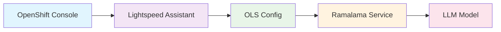

# OpenShift Lightspeed Integration with Ramalama Models

This directory contains GitOps-ready manifests for deploying OpenShift Lightspeed with automatic integration to your deployed ramalama LLM models.

## 🎯 What is OpenShift Lightspeed?

OpenShift Lightspeed is Red Hat's AI-powered assistant that integrates directly into the OpenShift web console to help with:
- 🔧 **Troubleshooting** cluster issues with natural language queries
- 📝 **Generating YAML** configurations and resources  
- 🛠️ **Step-by-step guidance** for complex OpenShift tasks
- 🔍 **Cluster resource investigation** and analysis
- 💡 **Best practices** recommendations

## 🏗️ Architecture



## 📋 Prerequisites

Before deploying OpenShift Lightspeed, ensure you have:

- **🔑 Cluster Admin Access**: Required for operator installation
- **☸️ OpenShift 4.15+**: Minimum supported version
- **🚀 Ramalama Models**: At least one ramalama model deployed (see [main README](../../README.md))
- **🔧 ArgoCD (Optional)**: For GitOps deployment

## ⚡ Quick Start

### Option 1: Deploy with ArgoCD

If you have ArgoCD installed, you can deploy using our ApplicationSet:

```bash
# Deploy all lightspeed configurations for all models
oc apply -f k8s/lightspeed/argocd/applicationset-lightspeed.yaml

# Or deploy for a specific model
oc apply -f k8s/lightspeed/argocd/application-qwen3-4b.yaml
```

### Option 2: Direct Kustomize Deployment

#### Deploy Base Lightspeed (Auto-Discovery)
```bash
# Deploy with auto-discovery of available models
oc apply -k k8s/lightspeed/overlays/auto-discovery
```

#### Deploy for Specific Model
```bash
# Deploy for Qwen 3 4B model
oc apply -k k8s/lightspeed/overlays/qwen3-4b

# Deploy for Qwen 3 30B model  
oc apply -k k8s/lightspeed/overlays/qwen3-30b

# Deploy for DeepSeek R1 model
oc apply -k k8s/lightspeed/overlays/deepseek-r1-qwen3-8b
```

## 📁 Directory Structure

```
k8s/lightspeed/
├── base/                               # Base OpenShift Lightspeed resources
│   ├── namespace.yaml                  # openshift-lightspeed namespace/project
│   ├── subscription.yaml               # Operator subscription
│   ├── olsconfig.yaml                  # Base OLS configuration
│   ├── credentials-secret.yaml         # API credentials for ramalama services
│   ├── lightspeed-postgres-secret.yaml # PostgreSQL credentials for conversation cache
│   └── kustomization.yaml             # Base kustomization
├── overlays/                     # Model-specific configurations
│   ├── auto-discovery/           # Auto-discover available models
│   ├── qwen3-4b/                # Qwen 3 4B model integration
│   ├── qwen3-30b/               # Qwen 3 30B model integration
│   └── deepseek-r1-qwen3-8b/    # DeepSeek R1 model integration
├── argocd/                      # ArgoCD applications
│   ├── application-qwen3-4b.yaml
│   └── applicationset-lightspeed.yaml
└── README.md                    # This file
```

## 🔧 Configuration Options

### Model Service Discovery

The system automatically discovers ramalama services using these naming conventions:

- **Service Pattern**: `{model-name}-ramalama-service.ramalama.svc.cluster.local`
- **Namespace**: All models are deployed in the `ramalama` namespace for simplified management
- **Port**: `8080`  
- **API Path**: `/v1` (OpenAI compatible)

### Supported Models

| Model | Service Name | Overlay Path |
|-------|-------------|--------------|
| **Qwen 3 1.7B** | `qwen3-1b-ramalama-service` | `overlays/qwen3-1b` |
| **Qwen 3 4B** | `qwen3-4b-ramalama-service` | `overlays/qwen3-4b` |
| **Qwen 3 30B** | `qwen3-30b-ramalama-service` | `overlays/qwen3-30b` |
| **DeepSeek R1** | `deepseek-r1-qwen3-8b-ramalama-service` | `overlays/deepseek-r1-qwen3-8b` |
| **Auto-Discovery** | Dynamic discovery | `overlays/auto-discovery` |

### Customizing for Your Models

To add support for a new model:

1. **Create a new overlay directory**:
   ```bash
   mkdir -p k8s/lightspeed/overlays/your-model-name
   ```

2. **Create kustomization.yaml**:
   ```yaml
   apiVersion: kustomize.config.k8s.io/v1beta1
   kind: Kustomization
   
   resources:
     - ../../base
   
   patches:
     - target:
         kind: OLSConfig
         name: cluster
       patch: |-
         - op: replace
           path: /spec/llm/providers/0/url
           value: http://your-model-service.ramalama.svc.cluster.local:8080/v1
         - op: replace
           path: /spec/llm/providers/0/models/0/name
           value: your-model-name
   ```

3. **Deploy your configuration**:
   ```bash
   oc apply -k k8s/lightspeed/overlays/your-model-name
   ```

## 🚀 Deployment Steps

### Step 1: Ensure Prerequisites

```bash
# Verify you have a ramalama model running in the ramalama namespace
oc get pods -l app.kubernetes.io/component=llm-server -n ramalama

# Verify you have cluster admin access
oc auth can-i '*' '*' --all-namespaces

# Note: All OpenShift Lightspeed resources will be deployed to the openshift-lightspeed namespace
```

### Step 2: Deploy OpenShift Lightspeed

Choose your deployment method:

#### Method A: ArgoCD ApplicationSet (All Models)
```bash
oc apply -f k8s/lightspeed/argocd/applicationset-lightspeed.yaml
```

#### Method B: Specific Model
```bash
oc apply -k k8s/lightspeed/overlays/qwen3-4b
```

#### Method C: Auto-Discovery  
```bash
oc apply -k k8s/lightspeed/overlays/auto-discovery
```

### Step 3: Verify Installation

All OpenShift Lightspeed resources are deployed in the `openshift-lightspeed` namespace:

```bash
# Check operator installation
oc get subscription -n openshift-lightspeed

# Check OLS configuration
oc get olsconfig -n openshift-lightspeed

# Check all secrets are properly deployed
oc get secrets -n openshift-lightspeed

# Check pods are running
oc get pods -n openshift-lightspeed

# Check service endpoints
oc get svc -n openshift-lightspeed

# Verify all resources in the namespace
oc get all -n openshift-lightspeed
```

### Step 4: Access OpenShift Lightspeed

1. **Open OpenShift Web Console**
2. **Look for the Lightspeed icon** (usually in the top navigation)
3. **Start asking questions** like:
   - "How do I create a deployment?"
   - "Show me how to troubleshoot pod failures"
   - "Generate a service YAML for my application"

## 🎉 Quick Commands Summary

```bash
# Deploy with ArgoCD (all models)
oc apply -f k8s/lightspeed/argocd/applicationset-lightspeed.yaml

# Deploy specific model
oc apply -k k8s/lightspeed/overlays/qwen3-4b

# Deploy with auto-discovery
oc apply -k k8s/lightspeed/overlays/auto-discovery

# Check status
oc get olsconfig,pods,svc -n openshift-lightspeed

# Clean up
oc delete -k k8s/lightspeed/overlays/qwen3-4b
```

---

**🎯 Ready to get AI-powered assistance for your OpenShift cluster?**

Deploy OpenShift Lightspeed today and start asking your cluster questions in natural language! 🚀 