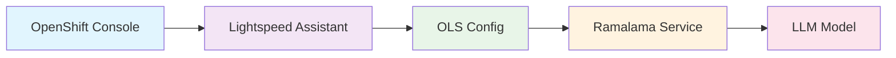

# OpenShift Lightspeed Integration with Ramalama Models

This directory contains GitOps-ready manifests for deploying OpenShift Lightspeed with automatic integration to your deployed ramalama LLM models.

## 🎯 What is OpenShift Lightspeed?

OpenShift Lightspeed is Red Hat's AI-powered assistant that integrates directly into the OpenShift web console to help with:
- 🔧 **Troubleshooting** cluster issues with natural language queries
- 📝 **Generating YAML** configurations and resources  
- 🛠️ **Step-by-step guidance** for complex OpenShift tasks
- 🔍 **Cluster resource investigation** and analysis
- 💡 **Best practices** recommendations

## 🏗️ Architecture



## 📋 Prerequisites

Before you begin, make sure you have:

- **🔑 Cluster Admin Access**: Required for operator installation
- **☸️ OpenShift 4.15+**: Minimum supported version
- **🚀 Ramalama Models**: *At least one ramalama model deployed in the `ramalama` namespace*
- **🔧 OpenShift GitOps (Optional)**: For GitOps deployment (Red Hat's ArgoCD distribution)

> [!IMPORTANT]  
> **Namespace Requirements**: Ensure you have at least one model running in the `ramalama` namespace before deploying Lightspeed. All model services are discovered using the `{model-name}-ramalama-service.ramalama.svc.cluster.local` pattern.

## ⚡ Quick Start

### Step 1: Verify Model Deployment

```bash
# Ensure you have at least one model running in the ramalama namespace
oc get pods -l app.kubernetes.io/name=ramalama -n ramalama

# Check available services
oc get svc -l app.kubernetes.io/name=ramalama -n ramalama

# If no models are deployed, deploy one first:
oc apply -f k8s/models/ramalama-namespace.yaml
oc apply -k k8s/models/qwen3-4b
```

### Step 2: Deploy OpenShift Lightspeed

Choose your deployment method:

#### Option 1: Deploy with OpenShift GitOps (Recommended)

If you have OpenShift GitOps installed, deploy a single model to avoid resource conflicts:

```bash
# Ensure OpenShift GitOps is installed and ready
oc get csv -n openshift-gitops-operator | grep gitops

# Deploy for a specific model (recommended)
oc apply -f k8s/lightspeed/argocd/application-qwen3-4b.yaml

# Check GitOps applications
oc get applications -n openshift-gitops | grep lightspeed
```

> [!WARNING]  
> **ApplicationSet Conflicts**: The ApplicationSet (`k8s/lightspeed/argocd/applicationset-lightspeed.yaml`) deploys multiple models that all conflict over the same `OLSConfig` resource. For production use, deploy only one Lightspeed configuration per cluster.

#### Option 2: Direct Kustomize Deployment

Due to timing dependencies between operator installation and CRD creation, direct kustomize deployment requires two steps:

##### Deploy for Specific Model (Recommended)
```bash
# Step 1: Install the operator (creates CRDs)
oc apply -k k8s/lightspeed/base/operator-only

# Step 2: Wait for operator to be ready
oc wait --for=condition=Ready pod -l app.kubernetes.io/name=lightspeed-operator -n openshift-lightspeed --timeout=100s

# Step 3: Apply the model configuration
oc apply -k k8s/lightspeed/overlays/qwen3-4b
# OR
oc apply -k k8s/lightspeed/overlays/qwen3-30b
# OR  
oc apply -k k8s/lightspeed/overlays/deepseek-r1-qwen3-8b
```

##### Deploy with Auto-Discovery
```bash
# Deploy with auto-discovery of available models
oc apply -k k8s/lightspeed/overlays/auto-discovery
```

### Step 3: Verify Installation

All OpenShift Lightspeed resources are deployed in the `openshift-lightspeed` namespace:

```bash
# Check operator installation
oc get subscription -n openshift-lightspeed

# Check OLS configuration
oc get olsconfig -n openshift-lightspeed

# Check all secrets are properly deployed
oc get secrets -n openshift-lightspeed

# Check pods are running
oc get pods -n openshift-lightspeed

# Check service endpoints
oc get svc -n openshift-lightspeed

# Verify all resources in the namespace
oc get all -n openshift-lightspeed
```

### Step 4: Access OpenShift Lightspeed

1. **Open OpenShift Web Console**
2. **Look for the Lightspeed icon** (usually in the top navigation)
3. **Start asking questions** like:
   - "How do I create a deployment?"
   - "Show me how to troubleshoot pod failures"
   - "Generate a service YAML for my application"
   - "What tools do you have access to?"

## 📁 Directory Structure

```
k8s/lightspeed/
├── base/                               # Base OpenShift Lightspeed resources
│   ├── namespace.yaml                  # openshift-lightspeed namespace/project
│   ├── subscription.yaml               # Operator subscription
│   ├── olsconfig.yaml                  # Base OLS configuration
│   ├── credentials-secret.yaml         # API credentials for ramalama services
│   └── kustomization.yaml             # Base kustomization
├── overlays/                     # Model-specific configurations
│   ├── auto-discovery/           # Auto-discover available models
│   ├── qwen3-1b/                # Qwen 3 1.7B model integration
│   ├── qwen3-4b/                # Qwen 3 4B model integration
│   ├── qwen3-30b/               # Qwen 3 30B model integration
│   └── deepseek-r1-qwen3-8b/    # DeepSeek R1 model integration
├── argocd/                      # ArgoCD applications
│   ├── application-qwen3-4b.yaml
│   └── applicationset-lightspeed.yaml
└── README.md                    # This file
```

## 🔧 Configuration Options

### Model Service Discovery

The system automatically discovers ramalama services using these naming conventions:

- **Service Pattern**: `{model-name}-ramalama-service.ramalama.svc.cluster.local`
- **Namespace**: All models are deployed in the `ramalama` namespace for simplified management
- **Port**: `8080`  
- **API Path**: `/v1` (OpenAI compatible)

### Supported Models

| Model | Service Name | Overlay Path |
|-------|-------------|--------------|
| **Qwen 3 1.7B** | `qwen3-1b-ramalama-service` | `overlays/qwen3-1b` |
| **Qwen 3 4B** | `qwen3-4b-ramalama-service` | `overlays/qwen3-4b` |
| **Qwen 3 30B** | `qwen3-30b-ramalama-service` | `overlays/qwen3-30b` |
| **DeepSeek R1** | `deepseek-r1-qwen3-8b-ramalama-service` | `overlays/deepseek-r1-qwen3-8b` |
| **Auto-Discovery** | Dynamic discovery | `overlays/auto-discovery` |

### Customizing for Your Models

To add support for a new model:

1. **Create a new overlay directory**:
   ```bash
   mkdir -p k8s/lightspeed/overlays/your-model-name
   ```

2. **Create kustomization.yaml**:
   ```yaml
   apiVersion: kustomize.config.k8s.io/v1beta1
   kind: Kustomization
   
   resources:
     - ../../base
   
   patches:
     - target:
         kind: OLSConfig
         name: cluster
       patch: |-
         - op: replace
           path: /spec/llm/providers/0/url
           value: http://your-model-service.ramalama.svc.cluster.local:8080/v1
         - op: replace
           path: /spec/llm/providers/0/models/0/name
           value: your-model-name
   ```

3. **Deploy your configuration**:
   ```bash
   oc apply -k k8s/lightspeed/overlays/your-model-name
   ```

## 🚀 Deployment Steps

### Step 1: Ensure Prerequisites

```bash
# Verify you have a ramalama model running in the ramalama namespace
oc get pods -l app.kubernetes.io/component=llm-server -n ramalama

# Verify you have cluster admin access
oc auth can-i '*' '*' --all-namespaces

# Note: All OpenShift Lightspeed resources will be deployed to the openshift-lightspeed namespace
```

### Step 2: Deploy OpenShift Lightspeed

Choose your deployment method:

#### Method A: Single Model with GitOps (Recommended)
```bash
# Ensure OpenShift GitOps is ready
oc get pods -n openshift-gitops

# Deploy single model Application
oc apply -f k8s/lightspeed/argocd/application-qwen3-4b.yaml

# Monitor deployment
oc get application openshift-lightspeed-qwen3-4b -n openshift-gitops -w
```

#### Method B: Direct Kustomize Deployment
```bash
oc apply -k k8s/lightspeed/overlays/qwen3-4b
```

#### Method C: Auto-Discovery  
```bash
oc apply -k k8s/lightspeed/overlays/auto-discovery
```

#### Method D: Multiple Models (Expert Only)

> [!WARNING]  
> **Resource Conflicts**: Multiple Applications will conflict over the same `OLSConfig`. Use only if you understand ArgoCD resource management and plan to manage conflicts manually.

```bash
# Deploy ApplicationSet (creates resource conflicts)
oc apply -f k8s/lightspeed/argocd/applicationset-lightspeed.yaml

# Monitor for SharedResourceWarning messages
oc get applications -n openshift-gitops | grep lightspeed
```

## 🎉 Quick Commands Summary

```bash
# Verify models are running in ramalama namespace
oc get pods -l app.kubernetes.io/name=ramalama -n ramalama

# Deploy with OpenShift GitOps (single model - recommended)
oc apply -f k8s/lightspeed/argocd/application-qwen3-4b.yaml

# Or deploy specific model directly (2-step process)
oc apply -k k8s/lightspeed/base/operator-only
oc wait --for=condition=Ready pod -l app.kubernetes.io/name=lightspeed-operator -n openshift-lightspeed --timeout=100s
oc apply -k k8s/lightspeed/overlays/qwen3-4b

# Check GitOps applications
oc get applications -n openshift-gitops | grep lightspeed

# Check status
oc get olsconfig,pods,svc -n openshift-lightspeed

# Clean up GitOps application
oc delete application openshift-lightspeed-qwen3-4b -n openshift-gitops

# Or clean up direct deployment
oc delete -k k8s/lightspeed/overlays/qwen3-4b
oc delete -k k8s/lightspeed/base/operator-only
```

## 🛠️ Troubleshooting

### Common Issues

#### 1. Model Service Not Found
```bash
# Check if models are running in the correct namespace
oc get svc -l app.kubernetes.io/name=ramalama -n ramalama

# Check OLS configuration
oc get olsconfig cluster -n openshift-lightspeed -o yaml | grep url

# Test service connectivity
oc exec -n openshift-lightspeed deployment/lightspeed-app-server -- curl -f http://qwen3-4b-ramalama-service.ramalama.svc.cluster.local:8080/v1/models
```

#### 2. OLS Configuration Conflicts
```bash
# Check for multiple overlapping configurations
oc get olsconfig -A

# View current configuration
oc describe olsconfig cluster -n openshift-lightspeed
```

#### 3. Operator Installation Issues
```bash
# Check operator subscription
oc get subscription lightspeed-operator -n openshift-lightspeed

# Check CSV status
oc get csv -n openshift-lightspeed | grep lightspeed

# Check operator logs
oc logs -l app.kubernetes.io/name=lightspeed-operator -n openshift-lightspeed
```

#### 4. Service Discovery Problems
```bash
# Check if ramalama services are accessible
oc get endpoints -n ramalama

# Test cross-namespace connectivity
oc run test-pod --rm -i --tty --image=curlimages/curl -- sh
# Inside the pod:
curl http://qwen3-4b-ramalama-service.ramalama.svc.cluster.local:8080/v1/models
```

### Debugging Commands

```bash
# Check all Lightspeed resources
oc get all -n openshift-lightspeed

# Check configuration
oc get olsconfig cluster -n openshift-lightspeed -o yaml

# Check logs
oc logs -l app.kubernetes.io/name=lightspeed-app-server -n openshift-lightspeed

# Check operator logs
oc logs -l app.kubernetes.io/name=lightspeed-operator -n openshift-lightspeed

# Test model connectivity
oc port-forward -n ramalama svc/qwen3-4b-ramalama-service 8080:8080
curl http://localhost:8080/v1/models
```

## 📚 Additional Resources

- [OpenShift Lightspeed Documentation](https://docs.openshift.com/container-platform/latest/openshift_lightspeed/about-openshift-lightspeed.html)
- [Ramalama Models Documentation](../README.md)
- [OpenShift GitOps Documentation](https://docs.openshift.com/gitops/latest/)

---

**🎯 Ready to get AI-powered assistance for your OpenShift cluster?**

Deploy OpenShift Lightspeed today and start asking your cluster questions in natural language! 🚀 